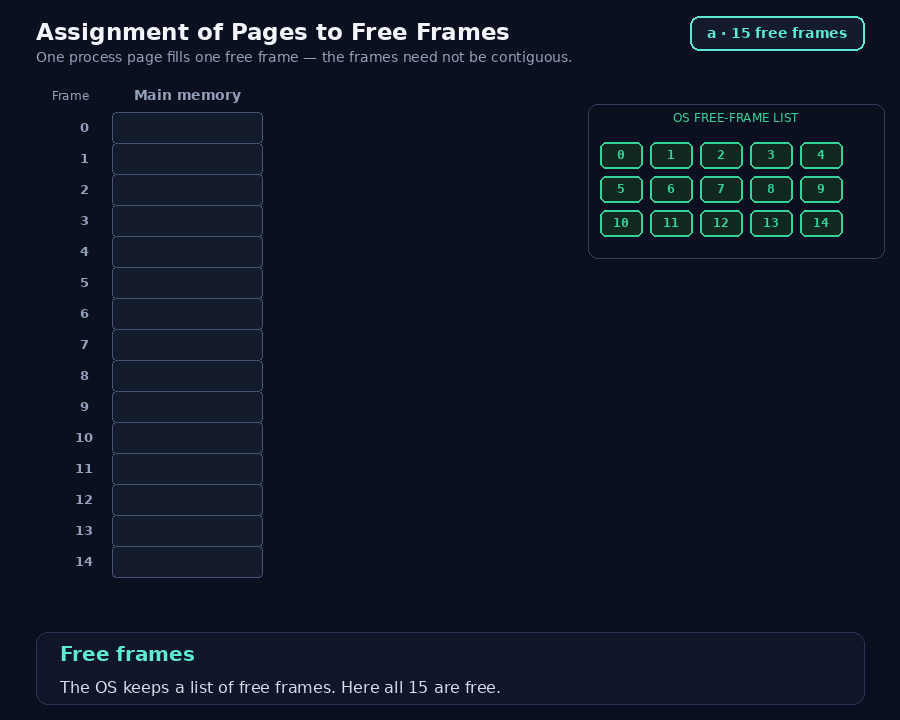
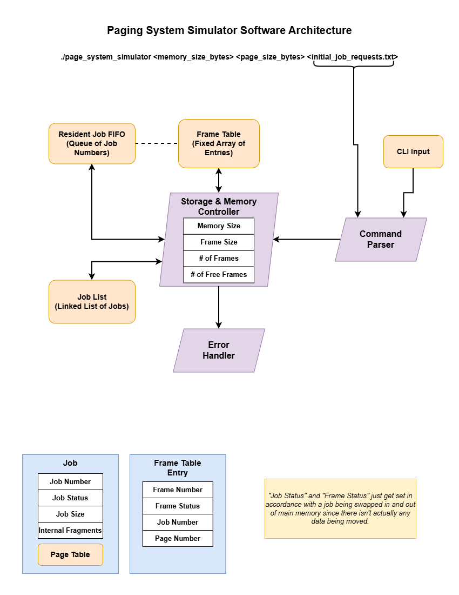

# Assignment 1 : A Simple Paging Simulator

**Topic:** Memory management (paging, swapping, internal fragmentation, logical to physical address translation)

**Detailed Desricption in:** [Assignment01.md](docs/Assignment01.md)

---

## Overview

You will simulate a **simple paging system**. Because this is *simple* paging, a job can execute only when **all** of its pages are resident in main memory; there is no demand paging. If main memory cannot hold a new (or resumed) job, you must swap other jobs out to secondary storage to make room.

Main memory is divided into equal-size **frames**. A job is divided into equal-size **pages** of the same size. You may assume the page size evenly divides the memory size, so the number of frames is always a whole number. A job's size, however, need **not** be a multiple of the page size — the leftover space in its last page is internal fragmentation.

### The Basic Idea

## Rough Software Architecture
